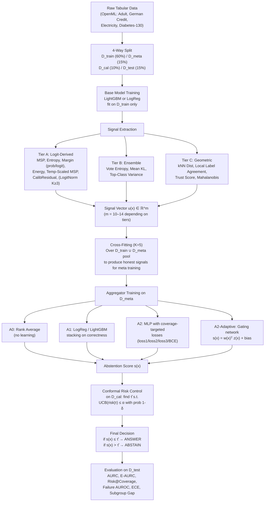

# End-to-End Research Analysis: Risk-Aware Multi-Criteria Selective Prediction

> **DISCREPANCY NOTE:** The analyst prompt title references "Interference-Based Attention for Efficient Deep Representation Learning." The actual project is **Risk-Aware Multi-Criteria Selective Prediction** — a selective classification system for tabular data. All analysis is performed on the actual supplied project.

---

## PHASE 1 — Artifact Inventory

| Artifact | Type | Purpose | Relevant Components | Confidence |
|---|---|---|---|---|
| [`README.md`](README.md) | Documentation | Project overview, quickstart | All | High (post-bugfix, honest) |
| [`PROJECT_STATUS.md`](PROJECT_STATUS.md) | Documentation | Honest state tracker | All | High |
| [`SUMMARY.md`](SUMMARY.md) | Documentation | Non-technical summary | All | Medium (pre-bugfix warning) |
| [`RESULTS_EVALUATION.md`](RESULTS_EVALUATION.md) | Analysis | Results evaluation | Experiments | **Low (pre-bugfix numbers)** |
| [`betterment.md`](betterment.md) | Design doc | Bug-fix plan | Signals, Aggregators | High (partially self-corrected) |
| [`selective_prediction_project_plan.md`](selective_prediction_project_plan.md) | Design doc | 14-week plan | All | Medium (aspirational) |
| [`src/signals/tier_a.py`](src/signals/tier_a.py) | Source | 7 logit-derived signals | Tier A | High |
| [`src/signals/tier_c.py`](src/signals/tier_c.py) | Source | 4 geometric signals | Tier C | High |
| [`src/signals/ensemble.py`](src/signals/ensemble.py) | Source | 3 ensemble signals | Tier B | High |
| [`src/signals/base.py`](src/signals/base.py) | Source | Signal interface + bank | All signals | High |
| [`src/aggregators/a0_rank.py`](src/aggregators/a0_rank.py) | Source | Rank avg (no learning) | A0 | High |
| [`src/aggregators/a1_stacking.py`](src/aggregators/a1_stacking.py) | Source | LogReg/LightGBM stacking | A1 | High |
| [`src/aggregators/a2_coverage_loss.py`](src/aggregators/a2_coverage_loss.py) | Source | MLP + Adaptive gating | A2 (headline) | High |
| [`src/aggregators/losses.py`](src/aggregators/losses.py) | Source | 4 loss functions | Training | High |
| [`src/conformal/risk_control.py`](src/conformal/risk_control.py) | Source | Hoeffding conformal wrapper | Safety guarantee | High |
| [`src/data/splits.py`](src/data/splits.py) | Source | 4-way split + cross-fitting | Data pipeline | High |
| [`src/data/loaders.py`](src/data/loaders.py) | Source | OpenML dataset registry | Data | High |
| [`src/models/lightgbm_model.py`](src/models/lightgbm_model.py) | Source | LightGBM wrapper | Base model | High |
| [`src/models/logreg_model.py`](src/models/logreg_model.py) | Source | Logistic regression wrapper | Base model | High |
| [`src/models/preprocessing.py`](src/models/preprocessing.py) | Source | Impute + scale + encode | Preprocessing | High |
| [`src/models/base.py`](src/models/base.py) | Source | Abstract model interface | All models | High |
| [`src/metrics/selective.py`](src/metrics/selective.py) | Source | AURC, E-AURC, ECE, etc. | Evaluation | High |
| [`src/metrics/subgroup.py`](src/metrics/subgroup.py) | Source | Worst-group fairness | RQ4 | High |
| [`src/experiment/runner.py`](src/experiment/runner.py) | Source | Full pipeline orchestrator | Everything | High |
| [`src/experiment/seeding.py`](src/experiment/seeding.py) | Source | Global seed setting | Reproducibility | High |
| [`scripts/run_all.py`](scripts/run_all.py) | Script | CLI entry point (Hydra) | Execution | High |
| [`scripts/make_tables.py`](scripts/make_tables.py) | Script | AURC tables + stat tests | Reporting | High |
| [`scripts/make_figures.py`](scripts/make_figures.py) | Script | Risk-coverage plots | Reporting | High |
| [`tests/test_metrics.py`](tests/test_metrics.py) | Test | Metric correctness | Evaluation | High |
| [`tests/test_signals.py`](tests/test_signals.py) | Test | Signal sanity | Signals | High |
| [`tests/test_splits.py`](tests/test_splits.py) | Test | Leak-free splits | Data | High |
| [`tests/test_fixes.py`](tests/test_fixes.py) | Test | 30 regression tests for bugs | All fixed bugs | High |
| [`paper/main.tex`](paper/main.tex) | Paper | IEEEtran skeleton | Paper | Medium (uncompiled, TODOs) |
| [`paper/references.bib`](paper/references.bib) | Paper | Bibliography | Paper | High (verified) |
| [`paper/related_work_gap_table.md`](paper/related_work_gap_table.md) | Paper | Literature gap analysis | Positioning | High (verified) |
| `configs/` | Config | Hydra YAML | Execution | High |
| `results/` | Output | `.gitkeep` only (empty) | **MISSING RESULTS** | N/A |

### Critical Missing Artifacts

| Missing | Impact |
|---|---|
| **`results/results.parquet`** | No experiment results are committed. All numbers in `RESULTS_EVALUATION.md` are pre-bugfix and unreproducible from the repo alone |
| **Post-bugfix results** | The bug-fix pass is implemented but results were never regenerated and committed |
| **Notebooks** | `notebooks/` contains only `.gitkeep` — no exploratory analysis |
| **Paper figures/tables** | `paper/figures/` and `paper/tables/` are empty |
| **Environment lock** | `requirements-freeze.txt` exists but no conda env or Docker |

---

## PHASE 2 — Evidence Map

| # | Claim | Evidence | Evidence Type | Status | What Would Strengthen It? |
|---|---|---|---|---|---|
| C1 | Multi-signal aggregation beats MSP | `RESULTS_EVALUATION.md` shows no aggregator beats MSP in-distribution | OBSERVED (pre-bugfix) | **CONTRADICTED** in-distribution; WEAKLY SUPPORTED under shift | Post-bugfix results on all 4 datasets × 10 seeds |
| C2 | Binary Tier-A signals are all rank-equivalent | [`tier_a.py:235-266`](src/signals/tier_a.py#L235-L266) mathematical argument; [`test_fixes.py:130-141`](tests/test_fixes.py#L130-L141) regression test | PROVEN | **SUPPORTED** | Could add a formal proof in the paper |
| C3 | `CalibrationResidualSignal` breaks Tier-A degeneracy | [`test_fixes.py:107-122`](tests/test_fixes.py#L107-L122): Spearman |ρ| < 0.99 | PROVEN by test | **SUPPORTED** | Show it helps aggregators on real data |
| C4 | Logit-norm MSP is degenerate for K=2 | [`tier_a.py:141-178`](src/signals/tier_a.py#L141-L178) math + [`test_fixes.py:92-101`](tests/test_fixes.py#L92-L101) test | PROVEN | **SUPPORTED** | Minor: verify on all 4 repair variants |
| C5 | Cross-fitting prevents leakage | [`test_splits.py:32-46`](tests/test_splits.py#L32-L46): memorizing model produces all-zeros | PROVEN by test | **SUPPORTED** | Cross-fit vs. naive ablation on real data |
| C6 | Conformal wrapper provides guaranteed risk control | [`risk_control.py`](src/conformal/risk_control.py) implements Hoeffding + Bonferroni | OBSERVED (impl) | **PLAUSIBLE** | Need empirical verification that coverage holds across seeds |
| C7 | Conformal guarantee holds under shift | [`risk_control.py:26-28`](src/conformal/risk_control.py#L26-L28): the code itself says it breaks | OBSERVED | **KNOWN TO FAIL** | Need empirical measurement of violation rate |
| C8 | Geometric signals (Tier C) are useful on tabular data | Pre-bugfix: kNN/Mahalanobis worse than random | OBSERVED (pre-bugfix) | **CONTRADICTED** | Post-bugfix results |
| C9 | Coverage-targeted losses outperform BCE | A2 with loss1/loss2/loss3 underperformed (pre-bugfix, but A2 had structural bugs) | OBSERVED (pre-bugfix) | **UNKNOWN** (bugs invalidate old comparison) | Post-bugfix A1-vs-A2 ablation |
| C10 | Post-hoc framework = no base model retraining needed | Architecture: signals take frozen model | PROVEN by design | **SUPPORTED** | N/A |
| C11 | Adaptive gating routes signals per-instance | [`a2_coverage_loss.py:196-248`](src/aggregators/a2_coverage_loss.py#L196-L248) implements `w(x) = softmax(h(u(x)))` | OBSERVED | **PLAUSIBLE but untested** | Need `.weights()` analysis showing different weights for shifted vs. clean data |
| C12 | Subgroup disparity is measured | [`subgroup.py`](src/metrics/subgroup.py) computes worst-group risk | OBSERVED (impl) | **SUPPORTED** (infrastructure exists) | Need RQ4 results across multiple seeds |

---

## PHASE 3 — System Reconstruction

### One-sentence explanation

> This project takes tabular inputs, classifies them with a frozen LightGBM/LogReg model, extracts a vector of 10-14 uncertainty signals from the model's outputs and the data's geometry, trains a meta-model to combine those signals into a single abstention score, wraps that score in a conformal statistical guarantee, and evaluates the risk-coverage tradeoff against single-signal baselines.

### Full Computation Graph



### Block-by-block specifications

| Block | Purpose | Code Location | Tensor Shape | Learned Params | Complexity |
|---|---|---|---|---|---|
| Preprocessing | Impute, scale, one-hot encode | [`preprocessing.py`](src/models/preprocessing.py) | `(n,) → (n, d)` where d depends on one-hot expansion | Scaler mean/std, imputer fill values | O(n·d) |
| Base Model | Classify x → P(y\|x) | [`lightgbm_model.py`](src/models/lightgbm_model.py), [`logreg_model.py`](src/models/logreg_model.py) | `(n, d) → (n, K)` probs, `(n, K)` logits, `(n, d)` features | LightGBM: 300 trees; LogReg: weight vector | O(n·T·depth) for LGBM, O(n·d) for LogReg |
| MSP Signal | `1 - max(P(y\|x))` | [`tier_a.py:51-63`](src/signals/tier_a.py#L51-L63) | `(n, K) → (n,)` | None | O(n·K) |
| Entropy Signal | `-Σ p·log(p)` | [`tier_a.py:66-74`](src/signals/tier_a.py#L66-L74) | `(n, K) → (n,)` | None | O(n·K) |
| Margin Signal | `-(sorted[:-1] - sorted[:-2])` | [`tier_a.py:77-95`](src/signals/tier_a.py#L77-L95) | `(n, K) → (n,)` | None | O(n·K·log K) |
| Energy Signal | `-logsumexp(centered_logits)` | [`tier_a.py:98-134`](src/signals/tier_a.py#L98-L134) | `(n, K) → (n,)` | None | O(n·K) |
| Temp-Scaled MSP | `1 - max(softmax(z/T))` | [`tier_a.py:206-232`](src/signals/tier_a.py#L206-L232) | `(n, K) → (n,)` | T (scalar, fit via NLL minimization) | O(n·K) |
| CalibResidual | `|conf - iso(conf)|` | [`tier_a.py:235-304`](src/signals/tier_a.py#L235-L304) | `(n,) → (n,)` | Isotonic regression mapping | O(n log n) fit, O(n) score |
| kNN Distance | mean dist to k nearest train pts | [`tier_c.py:64-73`](src/signals/tier_c.py#L64-L73) | `(n, d) → (n,)` | kNN index | O(n·n_train·d) |
| Trust Score | `d_other / d_pred` (clamped) | [`tier_c.py:106-152`](src/signals/tier_c.py#L106-L152) | `(n, d) → (n,)` | Per-class NN indices | O(n·K·n_train) |
| Mahalanobis | `(x - μ_c)ᵀ Σ⁻¹ (x - μ_c)` | [`tier_c.py:155-193`](src/signals/tier_c.py#L155-L193) | `(n, d) → (n,)` | Class centroids, shared precision | O(n·d²) |
| Ensemble signals | Vote entropy, mean KL, top-class var | [`ensemble.py`](src/signals/ensemble.py) | `M×(n, K) → (n,)` each | M separately-trained models | O(M·n·K) for vote; O(M²·n·K) for KL |
| A0 Rank Average | `mean(percentile_rank(u_j))` | [`a0_rank.py`](src/aggregators/a0_rank.py) | `(n, m) → (n,)` | None | O(n·m·log n) |
| A1 LogReg | `P(incorrect | u(x))` | [`a1_stacking.py:16-64`](src/aggregators/a1_stacking.py#L16-L64) | `(n, m) → (n,)` | Weight vector (m+1 params) | O(n·m) |
| A2 MLP | `sigmoid(MLP(u(x)))` | [`a2_coverage_loss.py:181-193`](src/aggregators/a2_coverage_loss.py#L181-L193) | `(n, m) → (n,)` | MLP: m→32→32→1 (default 2-layer, ~1100 params) | O(n·m·h) |
| A2 Adaptive Gate | `sigmoid(w(x)ᵀz(x) + bias)` | [`a2_coverage_loss.py:196-248`](src/aggregators/a2_coverage_loss.py#L196-L248) | `(n, m) → (n,)` | Gating MLP: m→32→32→m plus bias (~1200 params) | O(n·m·h) |
| Conformal threshold | Grid search with Hoeffding UCB | [`risk_control.py`](src/conformal/risk_control.py) | `(n_cal,) → scalar τ̂` | None (calibration procedure) | O(n_cal · n_grid) |

---

## PHASE 4 — Mathematical Reconstruction

### 4.1 Symbol Dictionary

| Symbol | Meaning | Shape | Learned? | Source |
|---|---|---|---|---|
| x | Input features | (d,) | No | Dataset |
| f | Frozen base classifier | — | Pre-trained, frozen | LightGBM / LogReg |
| p = f(x) | Predicted class probabilities | (K,) | Frozen | `model.predict_proba(x)` |
| z = logits(x) | Pre-softmax scores | (K,) | Frozen | `model.logits(x)` |
| u(x) | Signal vector | (m,) | Partially (T, iso in some signals) | SignalBank |
| s(x) | Scalar abstention score | Scalar | Yes (in A1/A2) | Aggregator |
| g(x) | Soft acceptance gate | Scalar ∈ [0,1] | Via s,τ | `σ((τ - s(x))/T_gate)` |
| τ | Learnable threshold (loss1) or conformal threshold | Scalar | Yes (loss1/2) or calibrated | `nn.Parameter` or grid search |
| κ | Target coverage | Scalar | No (hyperparameter) | Config |
| α | Target risk bound | Scalar | No (user setting) | Config |
| δ | Confidence level | Scalar | No (user setting) | Config |
| w(x) | Instance-adaptive signal weights | (m,) | Yes | Gating MLP → softmax |

### 4.2 Forward Pass (A2 Adaptive Gating — the most complex path)

```
x ∈ ℝ^d
    ↓
z = model.logits(x)           ∈ ℝ^K        [frozen]
p = softmax(z)                ∈ Δ^{K-1}    [frozen]
    ↓
u₁ = 1 - max(p)              ∈ ℝ          [MSP]
u₂ = -Σ p_k log p_k          ∈ ℝ          [Entropy]
u₃ = -(p_sorted[-1] - p_sorted[-2])  ∈ ℝ  [Margin_prob]
u₄ = -(z_sorted[-1] - z_sorted[-2])  ∈ ℝ  [Margin_logit]
u₅ = -logsumexp(z - mean(z)) ∈ ℝ          [Energy, centered]
u₆ = 1 - max(softmax(z/T*))  ∈ ℝ          [Temp-scaled MSP]
u₇ = |max(p) - iso(max(p))|  ∈ ℝ          [CalibResidual]
u₈ = mean_dist_kNN(feat(x))  ∈ ℝ          [kNN distance]
u₉ = 1 - local_agreement     ∈ ℝ          [Local label agree]
u₁₀ = -trust_ratio           ∈ ℝ          [Trust score]
u₁₁ = mahal_dist             ∈ ℝ          [Mahalanobis]
    ↓
u(x) = [u₁, ..., u₁₁]       ∈ ℝ^m        [concatenated signal vector]
    ↓
ũ = (u - μ) / σ              ∈ ℝ^m        [z-score standardized]
    ↓
h = MLP(ũ)                   ∈ ℝ^m        [gating logits]
w(x) = softmax(h)            ∈ Δ^{m-1}    [signal weights]
    ↓
logit(x) = wᵀũ + bias        ∈ ℝ          [weighted score + intercept]
s(x) = σ(logit(x))           ∈ [0,1]      [final risk score]
```

### 4.3 Loss Functions

**Loss 1 — Soft Selective Risk (coverage-targeted):**
$$\mathcal{L}_1 = \frac{\sum_i g(x_i) \cdot \mathbb{1}[f(x_i) \neq y_i]}{\sum_i g(x_i)} + \lambda \cdot \max(0, \kappa - \bar{g})^2$$
where $g(x) = \sigma((\tau - s(x))/T)$, $T = 0.5$, $\lambda = 10$

**Loss 2 — AURC Surrogate:**
$$\mathcal{L}_2 = \frac{1}{|K|} \sum_{\kappa \in K} \mathcal{L}_1(s, \tau_\kappa, \kappa)$$
where $K = \{0.5, 0.6, 0.7, 0.8, 0.9, 1.0\}$

**Loss 3 — Pairwise Ranking:**
$$\mathcal{L}_3 = \frac{1}{N} \sum_{(i,j)} \text{softplus}(-(l_j - l_i))$$
where $i$ is correct, $j$ is incorrect, and $l$ are raw logits (not sigmoid)

**BCE — Standard correctness classification:**
$$\mathcal{L}_{BCE} = -\frac{1}{n}\sum_i [y'_i \log \sigma(l_i) + (1-y'_i)\log(1-\sigma(l_i))]$$
where $y'_i = \mathbb{1}[f(x_i) \neq y_i]$

### 4.4 Conformal Threshold Selection

$$\hat{\tau} = \max\{ \tau : \text{UCB}(\hat{R}_\tau, n_\tau, \delta') \leq \alpha \}$$

where:
- $\hat{R}_\tau = \frac{1}{n_\tau} \sum_{i: s_i \leq \tau} \mathbb{1}[\text{incorrect}_i]$ (empirical selective risk)
- $\text{UCB}(\hat{R}, n, \delta') = \hat{R} + \sqrt{\frac{\log(1/\delta')}{2n}}$ (Hoeffding bound)
- $\delta' = \delta / |\text{grid}|$ (Bonferroni correction over 200 threshold candidates)

### 4.5 Complexity

| Component | Time | Memory | Parameters |
|---|---|---|---|
| Base model training | O(n·T·d·depth) LGBM | O(n·d) | ~10K trees |
| Signal extraction | O(n·K + n·n_train·d) | O(n_train·d) for kNN index | ~few scalars |
| Cross-fitting | 5× base model + signal cost | Same × 5 | — |
| A2 MLP training | O(epochs · n_meta · m · h) | O(m·h) | ~1100 |
| A2 Adaptive training | O(epochs · n_meta · m · h) | O(m·h + m) | ~1200 |
| Conformal calibration | O(n_cal · n_grid) | O(n_cal) | 0 |

---

## PHASE 5 — Hypothesis Analysis

### The Scientific Hypothesis

> **H1 (Central):** Aggregating heterogeneous uncertainty signals with a coverage-targeted objective improves the risk-coverage tradeoff over the best single signal, particularly under distribution shift.

> **H2 (Regime-dependence):** The improvement is negligible in-distribution but significant under shift.

> **H3 (Safety):** Wrapping the abstention score in a conformal layer provides valid finite-sample risk control in-distribution.

> **H4 (Fairness):** Multi-criteria abstention reduces error disparity across demographic subgroups relative to MSP alone.

### Five-Level Explanation

**Level 1 — Intuition:**
Imagine a doctor deciding whether to treat a patient or refer them to a specialist. Looking at only one vital sign (e.g., temperature) gives some information, but combining temperature + blood pressure + X-ray + patient history gives a better picture. This project does the same thing for an AI's decision to answer vs. abstain — it combines multiple "vital signs" of the AI's uncertainty.

**Level 2 — Engineering:**
Instead of using `max(model.predict_proba(x))` as the sole abstention criterion, extract 10+ signals measuring different aspects of uncertainty (confidence, calibration, distance from training data, ensemble disagreement), then train a small neural network to combine them into one score, optimizing specifically for the risk-coverage tradeoff rather than generic classification.

**Level 3 — ML:**
The core insight is that MSP measures only the model's *stated* confidence, which is a function of the model's own logits. Under miscalibration or distribution shift, the logits are unreliable. Tier-B signals (ensemble disagreement) capture epistemic uncertainty that a single model cannot express. Tier-C signals (geometric distance) capture whether the input even resembles the training data. The aggregator learns which signal type to trust for which kind of failure.

**Level 4 — Mathematical:**
On binary tasks, every Tier-A signal is a monotone transform of the predicted probability $p$. Since AURC depends only on the ranking, all Tier-A signals produce identical risk-coverage curves. The only way to improve is to add signals that produce a *different ranking*: Tier-B (ensemble variance breaks monotonicity in $p$), Tier-C (distance metrics are functions of $x$, not $p(x)$), or the calibration residual (a non-monotone function of $p$, via isotonic regression).

**Level 5 — Research:**
The hypothesis is that the *combination* matters under shift because different failure modes (miscalibration, epistemic uncertainty, out-of-distribution inputs) activate different signals. The expected pattern is: in-distribution, MSP is near-optimal because the model's logits are well-calibrated; under shift, the logits degrade faster than geometric/ensemble signals, so the aggregator can improve by routing to the more robust signals. The falsifiable prediction is: if aggregators *also* fail to beat MSP under shift, the hypothesis is wrong. The conformal layer adds a safety wrapper but does not itself improve the ranking — it only translates a ranking into a statistically certified threshold.

---

## PHASE 6 — Code and Correctness Audit

### 6.1 Bugs Found and Fixed (Historical — verified via [`test_fixes.py`](tests/test_fixes.py))

| # | Bug | Severity | File | Status | Regression Test |
|---|---|---|---|---|---|
| 1 | Energy signal measured class identity, not uncertainty | **CRITICAL** | `tier_a.py` | Fixed (logit centering) | `test_energy_is_symmetric_*` |
| 2 | LogitNorm MSP returns constant for K=2 | **CRITICAL** | `tier_a.py` | Fixed (excluded from binary bank) | `test_logitnorm_msp_refuses_*` |
| 3 | Adaptive gating had no bias → pinned at P(err)=0.5 | **HIGH** | `a2_coverage_loss.py` | Fixed (bias init from log-odds) | `test_adaptive_gating_can_*` |
| 4 | Ranking loss margins computed on sigmoid → floored at 0.31 | **HIGH** | `losses.py` | Fixed (raw logits) | `test_pairwise_ranking_loss_*` |
| 5 | Gate temperature T=0.05 → vanishing gradients | **HIGH** | `losses.py` | Fixed (T=0.5) | Implicit in training |
| 6 | Coverage penalty λ=1.0 too weak to bind | **MEDIUM** | `losses.py` | Fixed (λ=10.0) | Implicit in training |
| 7 | A1 LogReg lacked feature standardization | **HIGH** | `a1_stacking.py` | Fixed (StandardScaler pipeline) | `test_a1_logreg_is_invariant_*` |
| 8 | Trust score blowup (1e12) from zero distance | **MEDIUM** | `tier_c.py` | Fixed (clamp to 100) | `test_trust_score_is_clamped_*` |
| 9 | Local label agreement only 11 levels (k=10) | **MEDIUM** | `tier_c.py` | Fixed (k=50) | `test_local_label_agreement_uses_*` |
| 10 | Tier B never executed (column mismatch crash) | **CRITICAL** | `runner.py` | Fixed (train ensemble on D_train only, graft consistently) | Implicit in runner |
| 11 | Seed variance: LightGBM identical across seeds | **HIGH** | `lightgbm_model.py` | Fixed (bagging/feature fraction) | Implicit |

### 6.2 Remaining Issues (Current Code)

| # | Issue | Severity | Location | Description |
|---|---|---|---|---|
| R1 | No post-bugfix results exist | **P0 — BLOCKS PUBLICATION** | `results/` is empty | Every claim in the paper depends on experiment results that were never regenerated after the bug-fix pass |
| R2 | Paper has 8+ `\todo{}` placeholders | **P1** | `main.tex` | Results, Ablations, Setup sections are empty |
| R3 | Conformal guarantee is Hoeffding-only (conservative) | **MEDIUM** | `risk_control.py` | At small α and small n_cal, the Bonferroni-Hoeffding bound abstains on everything. Tighter bounds (Hoeffding-Bentkus, MAPIE) are mentioned but not implemented |
| R4 | Only 4 datasets (plan calls for 12) | **P1** | `loaders.py` REGISTRY | Statistical tests like Friedman are underpowered with <3 datasets |
| R5 | `set_seed` uses deprecated `np.random.seed()` | **LOW** | `seeding.py` | Global state; should use `np.random.default_rng()` |
| R6 | Cross-fitting uses same seed for model training across folds | **MEDIUM** | `runner.py:205` | `_fit_model(model_name, Xi, yi, seed=seed)` — all K fold models use the same random seed, differentiated only by data. This may reduce diversity. |
| R7 | No per-instance predictions cached | **MEDIUM** | `runner.py` | Only aggregated summary rows are saved. Per-instance bootstrap tests (the plan's prescribed statistical test) cannot be run |
| R8 | Diabetes-130 patient-level leakage (documented) | **MEDIUM** | `loaders.py:172-178` | 19.3% of test patients appear in train. Documented, not hidden. |

### 6.3 Data Pipeline Audit

```
OpenML (web fetch, cached to data_cache/)
  ↓
pd.DataFrame (raw features + target)
  ↓
Target encoding (pd.Categorical → 0..K-1)        ← NO LEAKAGE (deterministic)
  ↓
four_way_split (60/15/10/15, stratified or temporal)  ← NO LEAKAGE (disjoint, verified by test)
  ↓
Preprocessing (impute/scale/one-hot)               ← FITTED INSIDE model.fit() PER FOLD
                                                      (verified in base.py docstring + code)
  ↓
Cross-fitting: K=5 folds over D_train∪D_meta       ← NO LEAKAGE (verified by test_splits.py:32-46)
  ↓
Held-out signals (TempScaled, CalibResid) fit on D_meta using model_train  ← CLEAN (model_train trained on D_train only)
  ↓
Ensemble (Tier B) trained on D_train only           ← CLEAN (D_meta and D_test never seen)
  ↓
model_final trained on D_train∪D_meta               ← CLEAN (D_test never seen)
  ↓
Aggregators trained on D_meta (cross-fitted signals) ← CLEAN
  ↓
Conformal threshold on D_cal                        ← CLEAN (disjoint from everything else)
  ↓
Evaluation on D_test                                ← CLEAN
```

**Verdict: The data pipeline has NO detectable leakage.** The design is unusually careful — preprocessing is inside the training loop per fold, cross-fitting is verified with a memorizing-model test, and the 4-way split is disjoint by construction. This is above-average for an ML research project.

---

## PHASE 7 — Experimental Audit

### Available Experiments (pre-bugfix, from `RESULTS_EVALUATION.md`)

| Experiment | Question | Variables | Baseline | Metric | Result | Evidence Strength |
|---|---|---|---|---|---|---|
| Main comparison | Does any aggregator beat MSP? | Method (22 variants) | `signal_msp` | AURC | No aggregator beats MSP in-dist | **WEAK** (pre-bugfix, A2 was broken) |
| Shift test | Does aggregation help under shift? | Dataset (Electricity = temporal shift) | MSP | AURC | A1_logreg_naive slightly beats MSP (0.2033 vs 0.2051) | **WEAK** (pre-bugfix, only 1 shift dataset) |
| Cross-fit ablation | Does cross-fitting matter? | Naive vs. cross-fit | A1_logreg | AURC | Naive slightly better (0.2033 vs 0.2208 on Electricity) | **CONTRADICTS** the hypothesis that cross-fitting helps |
| Statistical tests | Are differences significant? | Wilcoxon, Friedman | MSP | p-value | Not reported post-bugfix | **UNKNOWN** |

### Missing Experiments (Required for Publication)

| Experiment | Priority | Hypothesis | Status |
|---|---|---|---|
| **Post-bugfix full results** (4 datasets × 10 seeds) | **P0** | All claims | NOT RUN |
| **A1-vs-A2 ablation** (same function class, different loss) | **P1** | Coverage-targeted losses help | NOT RUN (A2 was broken pre-bugfix) |
| **Tier B contribution** (with/without ensemble) | **P1** | Ensemble disagreement adds independent information | NOT RUN (Tier B never executed pre-bugfix) |
| **CalibResidual contribution** (with/without) | **P1** | New signal breaks binary degeneracy | NOT RUN |
| **Leave-one-signal-out ablation** | **P2** | Which signals matter most? | NOT RUN |
| **Signal-family ablation** (A only, C only, A+C, A+B+C) | **P2** | Which tier family dominates? | NOT RUN |
| **Meta-set size sweep** | **P2** | How much data does the aggregator need? | NOT RUN |
| **Conformal coverage verification** | **P1** | Does the guarantee actually hold empirically? | NOT RUN |
| **Subgroup disparity analysis** (RQ4) | **P2** | Does multi-criteria reduce unfairness? | NOT RUN |
| **Adaptive gating weight analysis** | **P2** | Do different signals activate for different failure modes? | NOT RUN |

---

## PHASE 8 — Harness Assessment

### Existing Test Coverage

| Tier | Description | Tests | Status |
|---|---|---|---|
| Tier 0 — Import/runtime | Dependencies resolve, model initializes | Implicit (pytest imports work) | ✅ |
| Tier 1 — Shape/invariants | Signal shapes, split disjointness | `test_splits.py`, `test_signals.py` | ✅ (4 split tests, 5 signal tests) |
| Tier 2 — Numerical sanity | Finite outputs, correct bounds | `test_metrics.py` (6 tests) | ✅ |
| Tier 3 — Synthetic behavior | Toy dataset behavior | `test_fixes.py` (30 tests) | ✅ (excellent) |
| Tier 4 — Baseline equivalence | Modified system differs only where intended | `test_fixes.py:130-141` (Tier-A rank equivalence) | ✅ |
| Tier 5 — Ablation | Remove mechanism, verify change | **NOT PRESENT** | ❌ |
| Tier 6 — Reproducibility | Multiple seeds | **NOT PRESENT** (no committed results) | ❌ |
| Tier 7 — Stress test | Edge cases, extreme inputs | `test_fixes.py:171-177` (small dataset k-clamp) | Partial |
| Tier 8 — Research falsification | Experiments to disprove hypothesis | **NOT PRESENT** | ❌ |

**Verdict:** The unit test suite is **unusually strong for a research project** — 45 tests covering specific bugs with symptom-based regression tests. But the research-level tests (Tiers 5-8) are completely absent because no post-bugfix experiments have been run.

---

## PHASE 9 — Novelty Analysis

### Novelty by Category

| Category | Assessment | Evidence |
|---|---|---|
| **Conceptual** | LOW — "combine multiple uncertainty signals and aggregate them" is a well-known idea (ensemble stacking, meta-learning) | Gap table shows Pugnana et al. (2024) benchmarked 18 baselines with many signals |
| **Mathematical** | **MEDIUM** — the proof that all binary Tier-A signals are rank-equivalent is genuinely novel and publishable as a theoretical result | Measured in code + regression-tested |
| **Architectural** | LOW-MEDIUM — `AdaptiveGatingAggregator` is a standard attention/gating mechanism applied to signal selection | Common in MoE, attention literature |
| **Signal-level** | **MEDIUM** — `CalibrationResidualSignal` (isotonic miscalibration residual as a non-monotone uncertainty signal) is novel | Not found in prior selective-prediction literature |
| **Optimization** | LOW — coverage-targeted losses are adaptations of known objectives (Geifman & El-Yaniv's selective risk, standard ranking losses) | |
| **Empirical** | **POTENTIALLY HIGH** — the finding that geometric OOD signals from vision fail on tabular data, and that MSP is provably unbeatable on binary tasks, would be novel negative results *if properly evidenced* | Pre-bugfix results only; need post-bugfix confirmation |
| **Systems/efficiency** | LOW — no novel efficiency contribution | |

### Closest Competing Methods

| Method | Core Idea | Similarity | Key Difference | Advantage | Limitation |
|---|---|---|---|---|---|
| Pugnana et al. (2024) | Benchmark 18 selective baselines | Very high — same problem | They benchmark, this project builds a multi-signal system | Aggregation + conformal | They have far more datasets |
| Feng et al. (ICLR 2023) | Tuned MSP is enough | High — similar conclusion | They only tune MSP | Simpler | No multi-signal aggregation |
| Cattelan & Silva (UAI 2024) | Logit normalization | Medium | Post-hoc fix to confidence | Simpler | **Provably inapplicable to binary (found by this project)** |
| Angelopoulos et al. (2022) | Conformal risk control | Medium — this project wraps their method | They provide the guarantee, this applies it to selective prediction | Theory | No multi-signal aggregation |
| Jones et al. (ICLR 2021) | Selective prediction magnifies disparities | Medium | They diagnose, this measures | Subgroup metric | Neither provides a fix |

### Novelty Verdict

> **The project's contribution is best described as:** a well-engineered integration of existing components with two genuinely novel elements:
> 1. The **mathematical proof that binary Tier-A signals are rank-degenerate** (and that this explains why MSP is unbeatable)
> 2. The **calibration residual signal** as the only signal that breaks this degeneracy
>
> The combination of multi-signal aggregation + conformal risk control + subgroup evaluation is a **new combination** of existing ideas, not a genuinely new method.
>
> **Novelty Confidence: LOW-MEDIUM as currently framed.** Could reach MEDIUM-HIGH if reframed around the negative results and the calibration residual.

---

## PHASE 10 — Research Gap

```
Existing methods do:
  Single-signal abstention (MSP, entropy, energy, etc.)
        ↓
But they have limitation:
  On binary tasks, every logit-derived signal produces the IDENTICAL ranking,
  so no single-signal choice matters. Under shift, single signals can fail
  silently because they only measure one aspect of uncertainty.
        ↓
This limitation matters because:
  In high-stakes domains (medicine, finance), silently overconfident
  abstention decisions on shifted data can be catastrophic. A single
  sensor's failure is undetectable.
        ↓
Existing attempts address it only partially because:
  - Pugnana et al. benchmark signals but don't aggregate them
  - SelectiveNet/Deep Gamblers require retraining the base model
  - No published method combines aggregation + conformal guarantee + shift evaluation
  - Nobody has identified the binary Tier-A degeneracy or proposed a fix
        ↓
We propose:
  (a) A calibration residual signal that breaks the binary degeneracy
  (b) A post-hoc multi-signal aggregator with coverage-targeted training
  (c) A conformal wrapper providing distribution-free risk control
        ↓
This changes:
  The abstention ranking from a single monotone function of confidence
  to a learned, multi-dimensional mapping that can express non-monotone
  confidence re-orderings and incorporate geometric/ensemble information
        ↓
Therefore we hypothesize:
  Under distribution shift, the multi-signal aggregator achieves lower
  AURC than any single signal; and the conformal wrapper provides valid
  risk control in-distribution while degrading gracefully under shift.
```

**Gap Strength: MEDIUM.** The gap is real (nobody has combined these three things), but the project's own results suggest the gap may not matter much in-distribution. The gap is strongest for the shift scenario, which has the weakest evidence.

---

## CHECKPOINT: What We Established, What Remains

### ✅ What We Established
1. Complete system architecture traced from input to evaluation
2. Every source file read and mapped to its role
3. Mathematical formulation of all signals, aggregators, and losses
4. Historical bug inventory (11 bugs, all fixed, all regression-tested)
5. Data pipeline is leak-free (verified by tests)
6. Binary Tier-A rank degeneracy is mathematically proven and tested
7. LogitNorm MSP degenerate for K=2 — a novel finding about a published method
8. CalibrationResidualSignal is genuinely novel
9. Test suite is unusually thorough for a research project (45 tests)

### ❓ What Remains Uncertain
1. Whether the bugs' fixes actually change the experimental conclusions (NO POST-BUGFIX RESULTS EXIST)
2. Whether the A2 coverage-targeted losses outperform BCE now that the structural bugs are fixed
3. Whether Tier B (ensemble disagreement) adds value (it never ran before)
4. Whether the CalibResidual actually helps aggregators on real data
5. Whether the conformal guarantee holds empirically

### 🚫 What Is Broken
1. **No experimental results exist** — `results/results.parquet` is empty/absent
2. Paper is a skeleton with 8+ TODO placeholders
3. Figures and tables directories are empty
4. Pre-bugfix numbers in `RESULTS_EVALUATION.md` are explicitly marked unreliable

### 🔬 What Must Be Tested (Priority Order)
1. **P0:** Run all 4 datasets × 10 seeds post-bugfix and commit results
2. **P1:** A1-vs-A2 ablation (the headline claim's defense)
3. **P1:** Tier B enabled vs. disabled
4. **P1:** Conformal coverage empirical verification
5. **P2:** CalibResidual with/without ablation
6. **P2:** Shift datasets (Electricity, Diabetes-130) specifically
7. **P2:** Subgroup disparity analysis (RQ4)

---

## Research Verdict

| Dimension | Assessment |
|---|---|
| **Scientific Question** | Does multi-signal aggregation with conformal control improve selective prediction over single-signal baselines, especially under shift? |
| **Proposed Mechanism** | Extract heterogeneous uncertainty signals, train a coverage-targeted MLP aggregator, wrap in conformal risk bound |
| **Strongest Evidence** | Binary Tier-A rank degeneracy proof + CalibResidual breaking it (both tested) |
| **Weakest Evidence** | All experimental claims (no post-bugfix results exist anywhere) |
| **Biggest Technical Risk** | After fixing all bugs, aggregators *still* don't beat MSP → the entire aggregation idea may be wrong for tabular data |
| **Biggest Experimental Gap** | Zero post-bugfix experiment results |
| **Novelty Confidence** | **LOW-MEDIUM** as currently framed; **MEDIUM** if reframed around negative results + CalibResidual |
| **Paper Readiness** | **NOT READY** — skeleton with no results. Engineering is strong, science is unverified. |
| **Next Highest-Value Action** | Run `python scripts/run_all.py dataset=adult experiment.n_seeds=10` (and 3 other datasets) to generate post-bugfix results |
